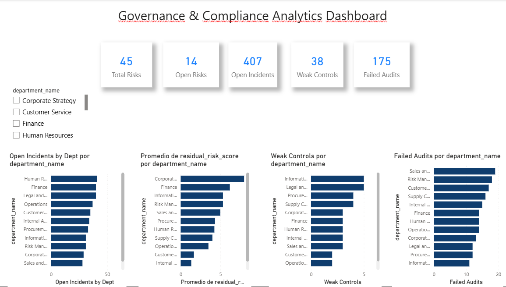
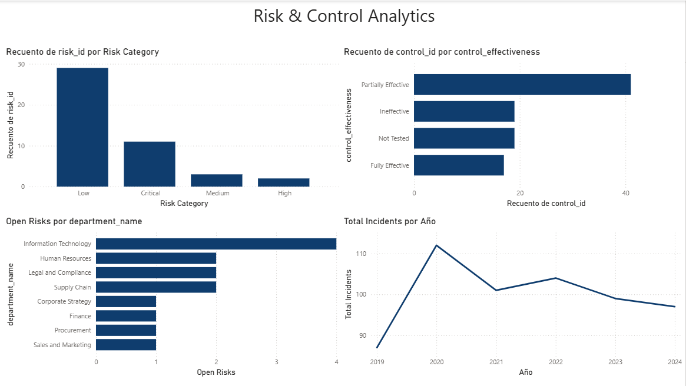
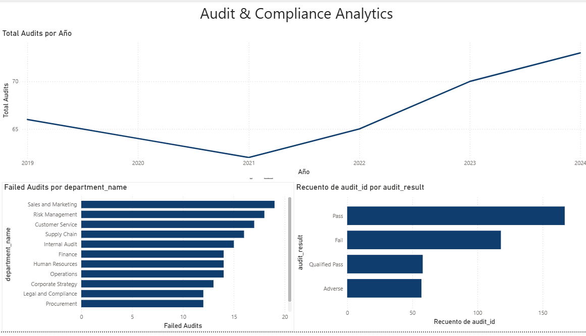

# Governance, Risk & Compliance (GRC) Analytics Dashboard

## Project Overview

This project analyzes a Governance, Risk & Compliance (GRC) dataset using SQL and Power BI to identify key risk, control, audit, and compliance trends across an organization.

The objective was to perform end-to-end data analysis, from SQL-based KPI validation and data exploration to dashboard development and business insight generation in Power BI.

---

## Tools & Technologies

- MySQL
- SQL
- Power BI
- DAX
- Data Modeling
- CSV Datasets
- GitHub

---

## Dataset

The project uses six interconnected datasets:

- Departments
- Employees
- Risks
- Controls
- Audits
- Compliance Incidents

The datasets were modeled as a relational structure to support governance, risk, audit, and compliance analytics.

---

## Project Workflow

1. Data import and validation in MySQL.
2. Development of analytical SQL queries.
3. Data modeling and relationship creation in Power BI.
4. KPI and DAX measure development.
5. Dashboard design and business analysis.
6. Documentation and publication on GitHub.

---

## Key Performance Indicators (KPIs)

The dashboard includes the following executive metrics:

- Total Risks
- Open Risks
- Open Compliance Incidents
- Weak Controls
- Failed Audits

---

## Dashboard Pages

### Executive Dashboard



Provides a high-level overview of the organization's governance, risk, and compliance posture.

Includes:

- Open Incidents by Department
- Residual Risk by Department
- Weak Controls by Department
- Failed Audits by Department

---

### Risk & Control Analytics



Focuses on risk exposure and control effectiveness.

Includes:

- Risk Distribution by Category
- Control Effectiveness Distribution
- Open Risks by Department
- Compliance Incident Trend

---

### Audit & Compliance Analytics



Focuses on audit performance and compliance monitoring.

Includes:

- Audit Results Distribution
- Failed Audits by Department
- Audit Trend Analysis

---

## SQL Analysis

A set of analytical SQL queries was developed to validate KPIs and support dashboard creation.

The analysis includes:

- Residual Risk Assessment
- Critical Open Risks Analysis
- Risk Reduction Evaluation
- Weak Controls Identification
- Open Compliance Incidents Analysis
- High Severity Incident Analysis
- Resolution Time Analysis
- Audit Findings Assessment
- Failed Audits Analysis
- Executive KPI Summary
- Incident Trend Analysis
- Governance Risk Heatmap

---

## Key Findings

- IT showed the highest concentration of weak controls.
- Corporate Strategy was among the departments with the highest residual risk exposure.
- Human Resources generated the largest number of open incidents.
- Sales & Marketing concentrated the highest number of failed audits.
- Audit activity increased steadily between 2022 and 2024.
- Compliance incidents peaked in 2020 and remained relatively stable afterwards.

---

## Business Value

This dashboard provides management-level visibility into:

- Risk exposure across departments.
- Control effectiveness and control weaknesses.
- Compliance incident trends.
- Audit performance and outcomes.
- Governance-related KPIs.

The project demonstrates how data analytics can support Governance, Risk & Compliance (GRC) decision-making and improve organizational oversight.

---

## Repository Structure

```text
Dashboard/
│
└── dashboard Governance - completo.pbix

Dataset/
├── departments.csv
├── employees.csv
├── risks.csv
├── controls.csv
├── audits.csv
└── compliance_incidents.csv

SQL/
└── governance_queries.sql

images/
├── Executive_Dashboard.png
├── Risk_Control_Analytics.png
└── Audit_Compliance_Analytics.png
```

---

## Author

**Marco Zarate**

Lawyer transitioning into Data Analytics with a focus on Governance, Risk Management, Compliance and Anti-Money Laundering (AML).

---
